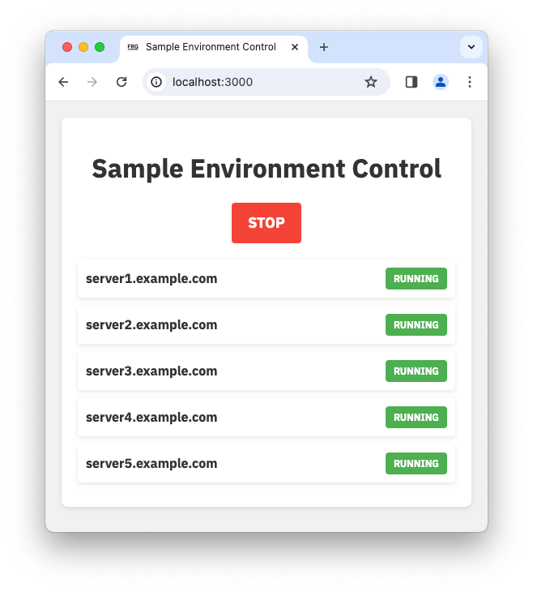

# River-Guide

[](https://goreportcard.com/report/github.com/frgrisk/river-guide)

River-Guide is a simple web interface for managing cloud instances.
Currently, AWS EC2 instances and Azure Virtual Machines are supported. It
utilizes the respective cloud provider's APIs to provide listing and
start/stop capabilities of instances through a web interface. River-Guide also
supports tag-based filtering of instances, enabling you to only display
instances of interest. Configuration can be provided through command line
flags, a configuration file, or environment variables.



## Installation

The simplest way to get started is using the [pre-built binaries](https://github.com/frgrisk/river-guide/releases).

```bash
if [[ $(uname -m) == aarch64 ]]; then
   GOARCH=arm64
else
   GOARCH=amd64
fi
curl -LO https://github.com/frgrisk/river-guide/releases/latest/download/river-guide-linux-$GOARCH
chmod +x river-guide-linux-$GOARCH
sudo cp river-guide-linux-$GOARCH /usr/local/bin/river-guide
```

Or, if you have Go installed, you can install it using Go.

```bash
go install github.com/frgrisk/river-guide@latest
```

## Authentication

For the application to work, it needs to have the necessary permissions to
list, start and stop instances. The application will use the credentials
configured on the machine it's running on. Approaches to authentication
vary by cloud provider and whether you're temporarily testing
the application or deploying it in a production environment.

For temporary testing, a common pattern is to use the AWS CLI or Azure
CLI to configure your credentials. For AWS, run `aws configure` and
provide your access key and secret key (see [_Get your AWS access keys_](https://aws.github.io/aws-sdk-go-v2/docs/getting-started/#get-your-aws-access-keys)).
You can also simply set the `AWS_ACCESS_KEY_ID`, `AWS_SECRET_ACCESS_KEY`,
and `AWS_SESSION_TOKEN` environment variables in your session if you have them.
For Azure, you can run `az login` and follow the instructions to authenticate.

For production deployments, you can use [instance profiles](https://docs.aws.amazon.com/IAM/latest/UserGuide/id_roles_use_switch-role-ec2_instance-profiles.html)
to pass an IAM role for **AWS** or [managed identities](https://learn.microsoft.com/en-us/azure/developer/go/azure-sdk-authentication-managed-identity?tabs=azure-cli)
for **Azure**. With either cloud provider, the application will automatically
use the credentials configured on the machine it's running on.

### Required Permissions

For AWS, the following [Amazon EC2 permissions](https://docs.aws.amazon.com/AWSEC2/latest/APIReference/API_Operations.html)
are required:

- `ec2:DescribeInstances`
- `ec2:StartInstances`
- `ec2:StopInstances`
- `ec2:DescribeInstanceStatus`

For Azure, the following [Microsoft.Compute permissions](https://learn.microsoft.com/en-us/azure/role-based-access-control/permissions/compute#microsoftcompute)
are required:

- `Microsoft.Compute/virtualMachines/read`
- `Microsoft.Compute/virtualMachines/instanceView/read`
- `Microsoft.Compute/virtualMachines/start/action`
- `Microsoft.Compute/virtualMachines/deallocate/action`

## Usage

### Examples

This section includes examples of how to use the application. See the
[Flags](#flags) section for a complete list of flags.

Start the server with the default settings, which will listen on port 3000 and
use AWS as the cloud provider, and display all instances.

```bash
river-guide
```

Start the server with a custom port and title.

```bash
river-guide --port 8080 --title "My Custom Title"
```

Query instances in a different region and filter on instances that have both tag
key "Environment" and value "dev" and tag key "DashboardManageable" and value
"true".

```bash
AWS_REGION=us-west-2 river-guide --tags "Environment=dev,DashboardManageable=true"
```

Use the Azure cloud provider and filter on instances in the "my-resource-group"
resource group having both tag key "Environment" and value "dev" and tag key
"DashboardManageable" and value "true".

```bash
river-guide --provider azure \
            --tags "Environment=dev,DashboardManageable=true" \
            --resource-group-name "my-resource-group" \
            --subscription-id "00000000-0000-0000-0000-000000000000"
```

### Flags

The application accepts several flags:

- `--config`: path to configuration file (default is `$HOME/.river-guide.yaml`).
- `-p, --port`: port to listen on (default is `3000`).
- `--path-prefix`: path prefix for the application (default is `/`). This
  can be useful when running the application behind a reverse proxy.
- `--provider`: cloud provider to use (default is `aws`).
- `--resource-group-name`: filter instances based on their resource group membership
  (only used with the Azure provider).
- `--subscription-id`: subscription ID to use (required for Azure).
- `-t, --tags`: filter instances using tag key-value pairs (e.g.,
  `Environment=dev,Name=dev.example.com`).
- `--title`: title to display on the web page (default is "Environment
  Control").
- `--primary-color`: primary color for text (default is "#333").
- `--favicon`: path to favicon (default is embedded favicon).
- `--rds`: enable support to control RDS instances (default is `false`). 

### Configuration file

The application can also use a configuration file for setting the parameters.
The configuration file should be in the YAML format. By default, the
application will look for a `.river-guide.yaml` file in the home directory.
The structure of the file should look something like this:

```yaml
port: 3000
tags:
  Environment: dev
  Name: dev.example.com
title: Environment Control
primary-color: "#333"
favicon: "/path/to/favicon"
```

### Environment variables

In addition to flags and the configuration file, you can also use
environment variables to set parameters. The application will automatically
look for any environment variables beginning with `RIVER_GUIDE_`. For
instance, to set the title, you could use the following command:

```bash
export RIVER_GUIDE_TITLE="My Custom Title"
```

## API

The application provides the following endpoints:

- `GET /`: The main interface for managing AWS EC2 instances.
- `GET /favicon.ico`: Endpoint for serving favicon.
- `POST /toggle`: Endpoint for toggling the start/stop state of all instances.

## To Do

- [ ] Add error handling for AWS API calls.

## License

River Guide is released under the MIT License. See the [LICENSE](./LICENSE)
file for more details.
